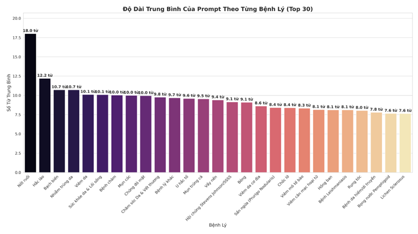

# 📚 LLM_datasets

## 📊 Thu Thập Dữ Liệu Về Bệnh Da  
(Tổng cộng **369.545 cặp** + lưu data file `.json`)

  

  

  

---

## 🗂️ Data 1: [kingabzpro/dermatology-qa-firecrawl-dataset](https://huggingface.co/datasets/kingabzpro/dermatology-qa-firecrawl-dataset)  
- **Số lượng:** 1K  
- **Cột:** `question`, `answer`, `condition`, `difficulty`, `source_url`  
- **Mục đích:** Huấn luyện AI/chatbot trả lời câu hỏi về bệnh da hoặc phân tích mức độ quan tâm của người dùng.  

  

  

  

---

## 🗂️ Data 2: [Mreeb/Dermatology-Question-Answer-Dataset-For-Fine-Tuning](https://huggingface.co/datasets/Mreeb/Dermatology-Question-Answer-Dataset-For-Fine-Tuning)  
- **Số lượng:** 1,460  
- **Cột:** `Prompt`, `response`, `prompt_word_count`, `response_word_count`  
- **Mục đích:** Huấn luyện AI/chatbot trả lời câu hỏi về da liễu.  

  

  

  

  

---

## 🗂️ Data 3: Dermatology Question-Answer Dataset (Kaggle)  
- **Số lượng:** 1,460  
- **Cột:** `Prompt`, `response`, `prompt_word_count`, `response_word_count`  
- **Mục đích:** Huấn luyện AI/chatbot trả lời câu hỏi về da liễu.  

  

  

  

  

---

## 🗂️ Data 4: [lavita/ChatDoctor-HealthCareMagic-100k](https://huggingface.co/datasets/lavita/ChatDoctor-HealthCareMagic-100k)  
- **Số lượng:** 13,389  
- **Nội dung:** Bệnh nhân mô tả triệu chứng → Bác sĩ phân tích, chẩn đoán → Đưa ra hướng giải quyết.  
- **Mục đích:** Huấn luyện chatbot y tế/AI cho các tình huống bệnh da.  

  

  

  

  

---

## 🗂️ Data 5: [Malikeh1375/medical-question-answering-datasets](https://huggingface.co/datasets/Malikeh1375/medical-question-answering-datasets)  
- **Số lượng:** 20,069  
- **Cột:** `instruction`, `input (Q)`, `output (A)`, `index_level`  
- **Lưu ý:** Chủ yếu tư vấn tổng quát (chăm sóc, phòng ngừa, dấu hiệu), không thay thế chẩn đoán.  

  

  

  

  

---

## 🗂️ Data 6: [abachaa/MedQuAD](https://huggingface.co/datasets/abachaa/MedQuAD)  
- **Số lượng:** 1,144 cặp QA  
- **Nguồn:** 12 website của NIH  
- **Mục đích:** Dataset y tế QA chuẩn, có chứa nhiều câu hỏi về bệnh da.  

  

  

  

  

---

## 🗂️ Data 7: [SCIN Dataset (Google Cloud)](https://console.cloud.google.com/storage/browser/dx-scin-public-data)  
- **Số lượng:** 5,033 cặp QA  
- **Nội dung:**  
  - Thông tin bệnh nhân: tuổi, giới tính, loại da Fitzpatrick  
  - Chủng tộc / dân tộc  
  - Triệu chứng & biểu hiện: ngứa, đau, sưng, chảy máu…  
  - Vị trí cơ thể: từ đầu/cổ → chân/bàn chân  
  - Thông tin bệnh & chẩn đoán  
  - Hình ảnh (close-up, góc xa, góc nghiêng)  
  - Đánh giá tone da: Fitzpatrick + Monk skin tone  
- **Mục đích:** Làm giàu input → chatbot hiểu tình huống tốt hơn.  

  

  

  

  

  

  

  

---

## 🗂️ Data 8: [MM-Skin](https://github.com/ZwQ803/MM-Skin)  
- **Số lượng:** 325,990 cặp QA  
- **Cột:** `question`, `answer`  
- **Mục đích:** Trả lời câu hỏi liên quan đến bệnh da.  

  

  

  

  

---

## 📌 Tổng Kết  
- **Tổng cộng:** 369,545 cặp QA  
- **Định dạng:** QA, mô tả bệnh, thông tin bệnh nhân, triệu chứng, hình ảnh  
- **Ứng dụng:** Huấn luyện AI/chatbot, phân tích xu hướng bệnh da, nghiên cứu y tế.  
